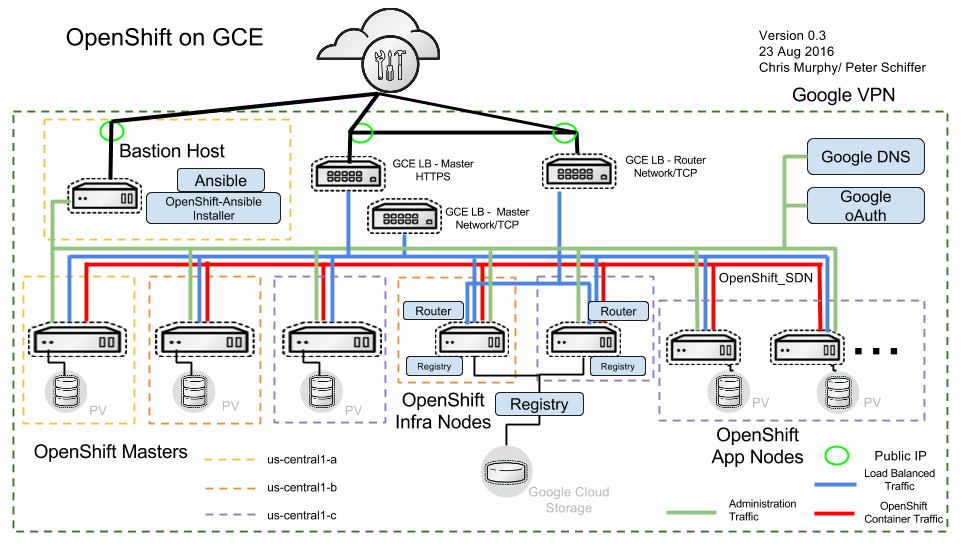

# openshift-enablement-exam

The following instructions will setup an OpenShift OCP 3.3 environment on Google Cloud compliant with the following reference architecture.




attention: this is all deprecated now.

## 3.6 changes

updated to 3.6
service catalog does not seem to install so it's disabled
you can now choose to install gluster with the following variable GLUSTER=yes


## Setup

Clone this project

```
git clone https://github.com/raffaelespazzoli/openshift-enablement-exam
cd openshift-enablement-exam
```

Create a [new google cloud project](https://cloud.google.com/resource-manager/docs/creating-project).

Install the [command line tool](https://cloud.google.com/sdk/downloads).

[Initialize and authenticate in gcloud](https://cloud.google.com/sdk/docs/authorizing).

In order to run this provisioning script you will need to be able to run 34vCPU, 3 global static IP addresses, and 10 in-use IP addresses in the US central region. You may need to increase your [resource quota](https://cloud.google.com/compute/docs/resource-quotas).

Enable your project to use the compute api by visiting the [compute engine](https://console.cloud.google.com/home) menu item (there is probably a better way to do it).

Set your google project configuration
```
export GCLOUD_PROJECT=<your project>
```
set your dns zone (es: exam.example.com). The name of the zone should be the same name of your google project.
your master will be available at `master.exam.example.com` and the routes will have the form `*.apps.exam.example.com`.

you need to externally configure your domain to point to google cloud dns. More explanations [here] (https://cloud.google.com/dns/update-name-servers)
```
export DNS_DOMAIN=<your domain>
```
Set you RHN account credentials.
```
export RHN_USERNAME=rhn-gps-rspazzol
export RHN_PASSWORD=xxx
```
define which key you want to use, this key must be available to the following ssh commands
```
export SSH_PUB_KEY=<the ssh pub key you want to use> #usually $HOME/.ssh/id_rsa.pub
```
Set the RHEL pool you want to use:
```
export RHN_SUB_POOL=8a85f9843e3d687a013e3ddd471a083e
```
I recommend having a script that sets up all your variables:
```
export GCLOUD_PROJECT=openshift-enablement-exam2
export DNS_DOMAIN=gc2.raffa.systems
export RHN_USERNAME=rhn-gps-rspazzol
export RHN_PASSWORD=XXXX
export SSH_PUB_KEY=$HOME/.ssh/id_rsa.pub
export RHN_SUB_POOL=8a85f9843e3d687a013e3ddd471a083e
```
If you are courageous you can just run:
```
./allinone.sh
```
but at least the first time, I recommend following the below scripts.

Another option is to deploy using google cloud deployment (a declarative way of creating resources).
This is still a work in progress. Cd to `cloud-deployment` and run:
```
./gcp-cloud-provision.sh
```

Provisioning Gluster CNS

if you desire to provision Gluster CNS export the following variable
```
export GLUSTER=yes
```
This will create an addtional disk of 200GB in each of the nodes and deploy Gluster CNS there.


## Gcloud provisioning

Run the provisioning script.

```
./provision-gcp.sh
```
This will take some time.

## Prepare the bastion host

I've switched to preemptible instances and preemptible instances don't always start when provisioned (a bug?). Go to your google console and make sure all the instances are stared.

Run the prepare bastion script.
```
./prepare-bastion.sh
```

## Prepare the cluster

Shell in the bastion host
```
ssh -o SendEnv=RHN_USERNAME -o SendEnv=RHN_PASSWORD -o SendEnv=DNS_DOMAIN -o SendEnv=RHN_SUB_POOL -o SendEnv=GLUSTER `gcloud compute addresses list | grep ose-bastion | awk '{print $3}'`
```
Run the prepare cluster script
```
cd openshift-enablement-exam
./prepare-cluster.sh
```

## Setup openshift

Run the ansible playbook
```
ansible-playbook -v -i hosts /usr/share/ansible/openshift-ansible/playbooks/byo/config.yml
```

## Creating new users

The admin/admin user is created by the installer.
You still have to give it permissions, for example (from one of the masters):
```
oc adm policy add-cluster-role-to-user cluster-admin admin
```
If you need to add more users, from the bastion host run the following
```
ansible 'masters' -i hosts -b -m shell -a "htpasswd -b /etc/origin/master/htpasswd <username> <password>"
```
## Clean up

To clean up your Google Cloud project type the following:
```
./cleanup-gcp.sh
```
This may take some time.
