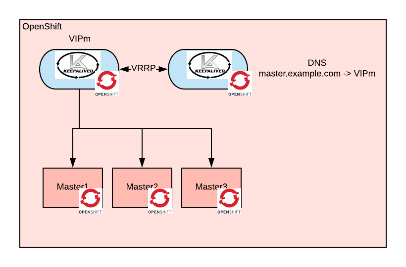
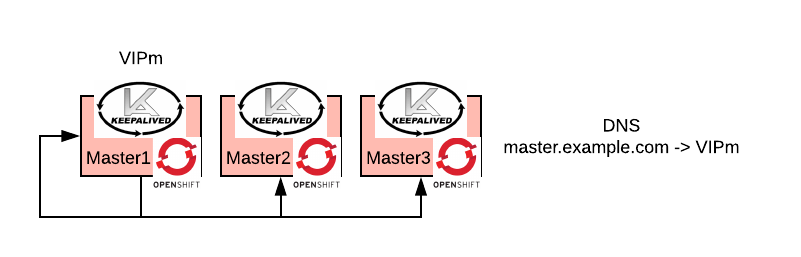

# Keepalived-based self-hosted load balancer for OpenShift

This is an Ansible playbook that install a L4 load balancer for Openshift. It will actually install two load balancers: one for the masters and one for the routers.
The load balancers are highly available by means of a VIP. Both the VIP and the load balancing functions are managed by Keepalived.
Keepalived is run as a pod inside openshift, therefore this loadbalancer is self-hosted.

The below diagram depicts the architecture:

 

The load balancer is needed before OpenShift starts. To work around this chicken-egg situation, the load balancer is deployed as a [static pod](https://kubernetes.io/docs/tasks/administer-cluster/static-pod/).

This playbook makes sure that the nodes running the keepalived static pod are correclty configured.
This playbook requires the definition of two new groups under the OSEv3 group: `master-lbs`, `routers-lbs`

```
[OSEv3:children]
masters
nodes
etcd
masters-lbs
routers-lbs
```

The masters usually do not have a significant load, so it is recommeded to deploy the master loadbalancer pods on the masters themselves, this picture shows the architecture:

 

so in the inventory file you should have something like:

```
[masters]
master1
master2
master3

[masters-lbs]
master1
master2
master3
```

The routers may have significat load so it's really up to you to decide which nodes to use to loadbalance their load.

the playbook needs the following additional configuration:

| variable | mandatory | description |
|:-:|:-:|:-:|
| static_pod_manifest_path  | yes  | where the pod manifest will be put on the node  |
| static_pod_config_path  | yes  | where the keepalived configuration will be put on the node  |
| lb_masters_vip  | yes  | the VIP to use for the masters, this should be an available and routable IP in the network of the nodes   |
| lb_routers_vip  | yes  | the VIP to use for the routers, this should be an available and routable IP in the network of the nodes  |

note that it is up to you to make sure that:

* `openshift_master_cluster_hostname`is resolved to `lb_masters_vip` by your DNS
* `openshift_master_cluster_public_hostname`is resolved to `lb_masters_vip` by your DNS
* `*.openshift_master_default_subdomain`is resolved to `lb_routers_vip` by your DNS

finally in order to instruct your nodes to load the static pods you should have the following configuration:

```
openshift_node_kubelet_args:
...
  pod-manifest-path:
  - "{{ static_pod_manifest_path }}" 
```

To run the playbook type the following:
```
ansible-playbook -i <your inventory> ./playbooks/deploy-loadbalancers.yaml
```

you should run the playbook before running the OpenShift installation playbook.

 